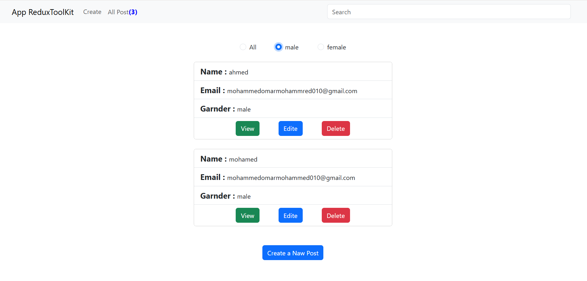

# Redux Toolkit CRUD App 🧩

A simple CRUD (Create, Read, Update, Delete) application built using React and Redux Toolkit, with data stored and managed through MockAPI.

---

## 📌 Overview

This project demonstrates how to manage application state using Redux Toolkit and perform CRUD operations with an external API (MockAPI).

It provides a clean and simple user interface for creating, viewing, editing, and deleting user data.

---

## ✨ Features

* ➕ Create new posts/users
* 📄 View all data
* ✏️ Edit existing data
* ❌ Delete data
* 🔍 Filter data by gender (male / female)
* ⚡ State management using Redux Toolkit

---

## 🛠️ Technologies Used

* React.js
* Redux Toolkit (RTK)
* React Bootstrap
* MockAPI (for backend simulation)

---

## 🚀 Live Demo

🔗https://crud-using-reduxtoolkit.web.app/

---
## 🚀 Getting Started

Clone the repository:

```bash id="8x1o4g"
git clone https://github.com/your-username/repo-name.git
```

Install dependencies:

```bash id="y3z9dp"
npm install
```

Run the project:

```bash id="zdlc5c"
npm start
```

---

## 🌐 API Used

This project uses MockAPI to simulate a backend for storing and retrieving data.

---

## 📸 Screenshots



